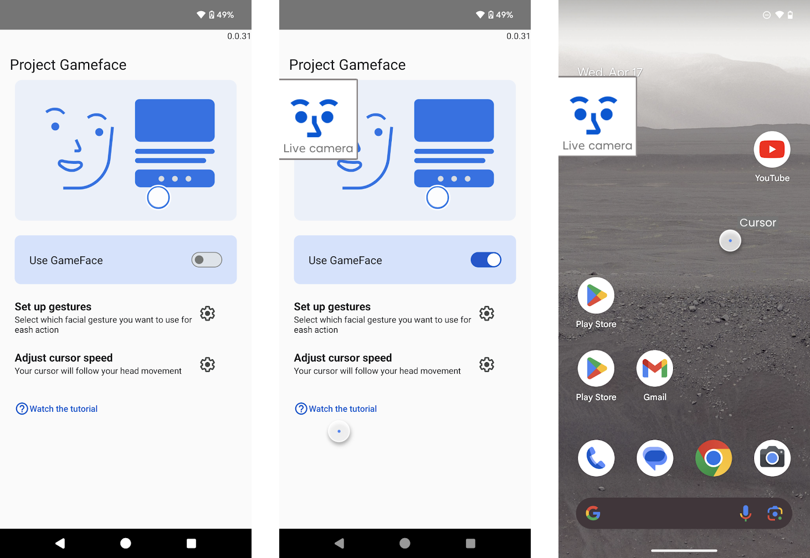
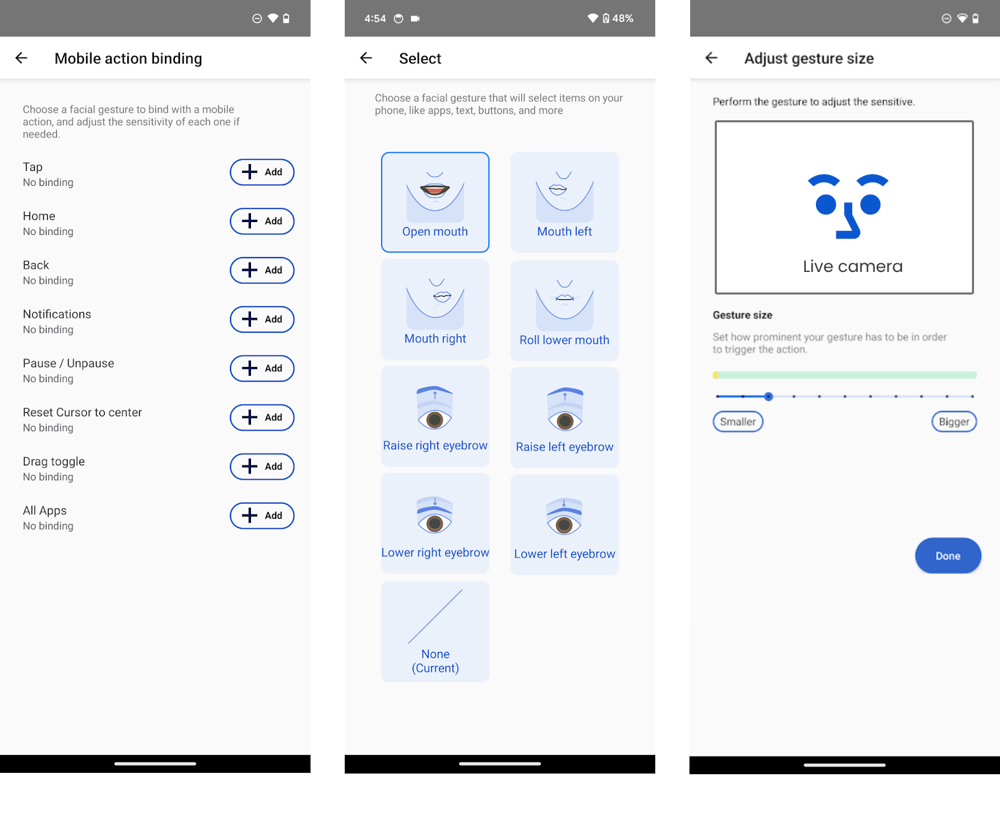
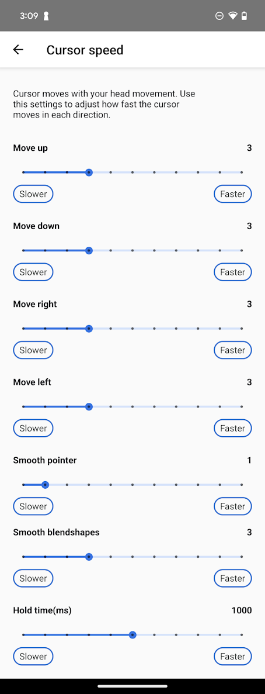

# Project Gameface Android
Project Gameface for Android introduces a novel way to navigate Android devices by using a virtual cursor.  Through the device's camera, it seamlessly tracks facial expressions and head movements, translating them into intuitive and personalized control. Developers can now build applications where their users can configure their experience by customizing facial expressions, gesture sizes, cursor speed, and more.

We are using the Android accessibility service to create a new cursor and are leveraging MediaPipe’s Face Landmarks Detection API to program the cursor in a way so it moves according to a user’s head movement. 

# Getting Started

## Prerequisites
1. Android Studio
2. Physical Android Device (Need to use camera.)

## Running the project
You can follow the easy steps below to setup a local instance of Project Gameface for Android:
1. Clone the repository to your local machine.
2. Open Android Studio and open the project.
3. Wait for Android Studio sync this project and download any dependencies.
4. Once the project is synced, you can build and run the app.

## Mobile action binding settings

Within the Face Landmarks Detection API, there are 52 face blendshape values which represent the expressiveness of 52 facial gestures such as raising left eyebrow or mouth opening. We use some of these 52 values to effectively map and control a wide range of functions, offering users expanded possibilities for customization and manipulation. We are also leveraging blendshapes coefficients which gives developers an ability to set different thresholds on each specific expression and this helps them customize the experience.

You can set the following mobile actions and customize a specific facial expression for each action:

- Tap  - Execute a tap where the cursor is (Default: Open mouth)
- Home - Go to home screen of your Android device
- Notification - Open the notification panel of your Android device
- Pause/Unpause cursor - Pause or unpause Gameface virtual cursor movement 
- Reset cursor to center  - Move cursor to screen center (Default: Mouth right)|
- Drag and hold - Set start and end points for dragging (Default: Mouth left)
- All apps - Open all apps page (available in Android version > 12)

# Settings
## Cursor speed settings

Developers can customize the cursor speed settings for the cursor in each direction and also enable specific advanced settings as shown below:

- Move up   - Cursor speed in the upward direction  
- Move down  - Cursor speed in downward direction    
-  Move left  - Cursor speed in left direction        
-  Move right - Cursor speed in right direction       
-  Smooth pointer  - Adjust the amount of cursor smoothness           
-  Smooth blendshapes  - Reduces the chance of triggering an action by accident but you'll need to hold your face gesture a bit longer.           
-  Hold time(ms)  - Hold action time in milliseconds
 

